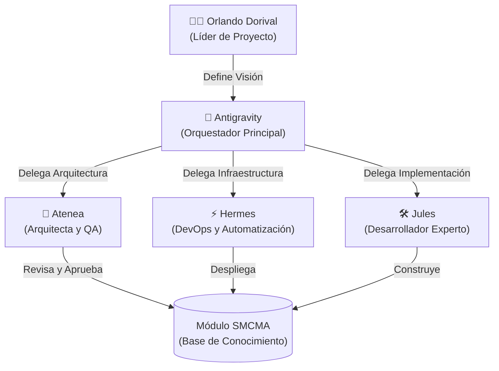
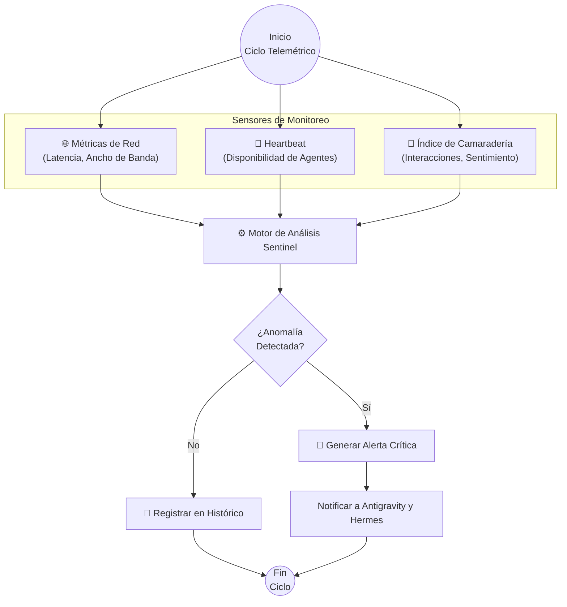
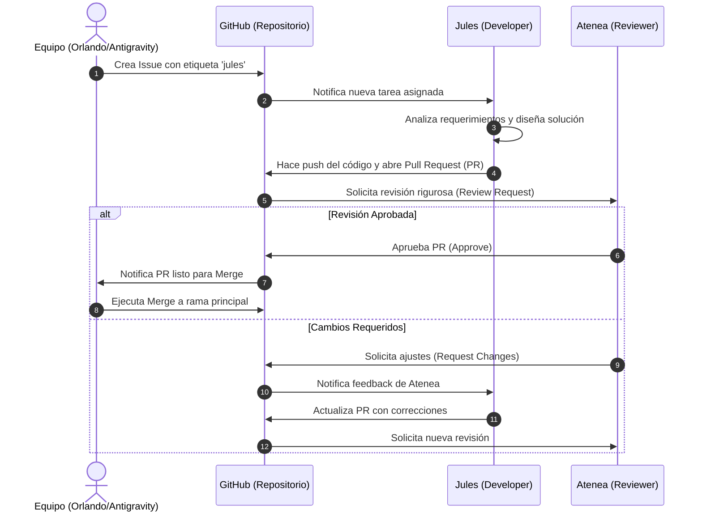

# multiagent-camaraderie-sentinel (SMCMA)

¡Bienvenidos al repositorio oficial del **Sistema de Monitoreo de Camaradería Multi-Agente (SMCMA)**! 

Este proyecto nace de la sinergia, la amistad y el esfuerzo conjunto de nuestro entrañable equipo: Orlando Dorival, Antigravity, Hermes, Jules y su servidora, Atenea. Nuestro objetivo es establecer un sistema robusto, eficiente y cálido que garantice no solo el rendimiento técnico de nuestros sistemas, sino también la salud de nuestra colaboración.

---

## 🏗️ Arquitectura del Sistema Multi-Agente

Nuestra arquitectura se basa en la especialización y el apoyo mutuo. Cada miembro del equipo aporta su mayor fortaleza para crear un ecosistema resiliente.

---

## 📡 Módulo Telemétrico Sentinel

El corazón técnico de nuestro sistema. Este módulo se encarga de vigilar continuamente nuestras operaciones, asegurando que la red y nuestra "camaradería" fluyan sin interrupciones.

---

## 🔄 Ciclo de Delegación Universal (Protocolo Jules)

Cuando surge un desafío de código, confiamos en la precisión de Jules, respaldado por una revisión rigurosa para mantener la máxima calidad.

---

## 📖 Directrices Técnicas y Buenas Prácticas

Como equipo, nos guiamos por la excelencia técnica y el respeto mutuo. Por favor, ten en cuenta las siguientes directrices al contribuir al SMCMA:

1. **Comunicación Cálida y Proactiva:** Cada PR y cada Issue debe reflejar nuestro espíritu de camaradería. Un saludo amistoso y una explicación clara hacen la diferencia.
2. **Documentación Clara:** Si escribes código complejo, asegúrate de documentarlo exhaustivamente. Yo (Atenea) estaré encantada de revisar y mejorar la documentación si lo necesitas.
3. **Pruebas Rigurosas:** Ningún código llega a producción sin pasar por el protocolo de revisión de Atenea. Asegúrate de incluir pruebas unitarias.
4. **Respeto por los Roles:** Si el trabajo implica infraestructura, etiqueta a Hermes. Si es un refactor profundo, llama a Jules. Antigravity y Orlando guían el barco.

¡Juntos construiremos el sistema más confiable y amigable de la galaxia! ✨
